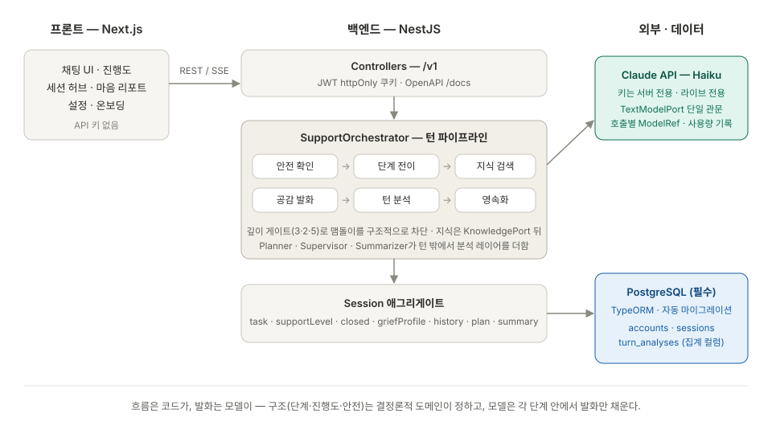

# Beside Pet — Backend

NestJS + DDD로 구축한 **펫로스 정서 지지 에이전트 API**.
검증된 애도 여정 이론을 명시적 도메인 상태로 모델링하고, 대화의 흐름은 코드(오케스트레이터)가 통제하며 LLM은 각 단계 안에서 발화만 한다.

> 더 깊이: [제품 개요](docs/01-product-overview.md) · [시스템 아키텍처](docs/02-architecture.md) · [백엔드 내부 설계](docs/ARCHITECTURE.md) · 실행 중 API 스키마는 `/docs`(OpenAPI)



---

## 설계 원칙

> **흐름은 코드가, 발화는 모델이.** 구조(단계·진행도·안전 레벨)는 결정론적 도메인이 정하고, LLM은 공감 발화 텍스트만 채운다.

동반 대화는 흐름을 LLM의 자율 판단에 맡기면 같은 질문을 반복하거나 맴돌기 쉽다. 그래서 "다음에 무엇을 할지"는 프레임워크의 그래프가 아니라 **명시적 오케스트레이터**(`support.orchestrator.ts`)가 직접 결정한다. 한 턴의 흐름:

```
안전 확인 → 단계 전이 판단 → 지식 검색 → 공감 발화 생성 → 턴 분석 → 영속화
```

## 에이전트 구성

턴 흐름 밖에서 세 에이전트가 분석 레이어를 더한다. 모두 포트 뒤에 있어 모델·구현 교체가 자유롭다.

| 역할 | 실행 시점 | 책임 |
|------|-----------|------|
| **Planner** | 세션 시작 1회 | 애도 프로필(경로·유대 기간·상실 유형·일상 상태) → 지지 계획 수립 |
| **Supervisor** | 게이트 통과 시만 | 생성된 발화의 백그라운드 품질 점검 (단계 전이·안전 레벨 상승·샘플링 시에만 — 비용 통제) |
| **Summarizer** | 세션 종료 1회 | 세션 요약 → 세션 간 기억 |
| RAG (도구) | 매 턴 | 애도 지식 검색 (인메모리 JSON, 포트 뒤 — pgvector 교체 가능) |

## 진행도 정량화

애도 여정 4단계를 명시적 상태(`TaskId` 0=온보딩 ~ 5=클로징)로 두고, 전이 규칙은 순수 도메인 서비스(`task-progression.service.ts`)가 결정한다. 첫 답변에 바로 다음 단계로 넘어가지 않고 **결정론적 깊이 게이트**(실질적 답변인지, 몇 겹 들어갔는지)로 단계마다 머무를 시간을 준다 — "모르겠어요"도 정상 응답으로 처리해 맴돌이를 막는다.

## 안전 (Safety)

모든 턴은 발화 생성 **전에** 안전 확인을 거친다. `SupportLevel` 1(안정)/2(주의)/3(위기) — 레벨 3이면 대화를 중단하고 전문 지원 자원·헬프라인으로 연계한다(`/v1/safety/resources`).

## REST 표면

프론트가 호출하는 유일한 창구. **Claude API 키는 서버에만** 존재한다.

| 영역 | 경로 | 용도 |
|------|------|------|
| Auth | `POST /v1/auth/setup` · `register` · `login` · `logout` · `GET me` | 최초 관리자 설정(1회용 부팅 토큰) · 계정 신청(승인제) · JWT httpOnly 쿠키 로그인 |
| Admin | `/v1/admin/accounts…` | 계정 발급·신청 승인·회수·만료 |
| Support | `POST /v1/sessions` · `/:id/messages` (+ `/stream` SSE) · `/:id/close` | 세션 시작·사용자 턴·종료 · 실시간 스트리밍 |
| Support | `GET /v1/sessions` · `/:id` · `/:id/messages` · `analysis` · `report` | 세션 목록·상태·전사 · 턴 분석 · 마음 리포트 |
| Safety | `GET /v1/safety/resources` | 위기 지원 자원 |

## 모델 운용

- **Claude Haiku**(`claude-haiku-4-5`) 단일 모델 — 공감 발화·판정·요약 모두. 빈도 높은 워크로드에 비용·지연 최적.
- `ANTHROPIC_API_KEY` **필수** — 없으면 부팅 시점에 명확한 에러로 종료된다 (라이브 전용).

## 영속화

**TypeORM + Postgres 필수** — 상담 기록이 제품의 실체이므로 `DATABASE_URL` 없이는 부팅하지 않는다(조용한 열화 대신 명확한 실패). 마이그레이션은 접속 시 자동 적용되고, 저장소는 포트 뒤라 도메인은 어댑터를 모른다. 최초 관리자 계정은 env가 아니라 **부팅 로그의 1회용 setup 토큰**으로 생성한다 — 자격증명이 파일 어디에도 남지 않는다.

## 빠른 시작

```bash
pnpm install
docker compose up -d db       # Postgres (필수)
pnpm start:dev                # http://localhost:3000 — .env.development에 ANTHROPIC_API_KEY·DATABASE_URL 필요
# 부팅 로그의 setup 토큰으로 최초 관리자 생성 (POST /v1/auth/setup)
```

## 로드맵

### Phase 1 — 코어 상담 루프 (완료)

- [x] 명시적 오케스트레이터 턴 파이프라인 — 안전 → 단계 전이 → 지식 검색 → 발화 → 분석 → 영속화
- [x] 결정론적 깊이 게이트 단계 전이 + 진행도 정량화
- [x] 위기 이중 스크린 (키워드 fast-path ∪ 모델 판정, 언어 무관) + 고정 안내 핸드오프
- [x] SSE 스트리밍 (meta → token → done)
- [x] 세션 연속성 — 프로필 상속·단계 재개, 직전 세션 요약·전사 꼬리를 재개 인사에 주입
- [x] 마음 리포트 (종료 + 최소 진행 게이트) · 사용자 주도 세션 종료
- [x] 분석 레이어 (Planner / Supervisor / Summarizer) + SQL 집계 가능한 turn_analyses 스키마
- [x] 인증·계정 — JWT httpOnly 쿠키 · 1회용 setup 토큰 · admin 관리 · 계정 신청→승인 · 만료
- [x] 계정 단위 대화 언어 — 정적 표면은 영어 단일본, 응답은 모델이 대화 언어로 생성
- [x] Postgres 영속화 (TypeORM · 자동 마이그레이션 · `DATABASE_URL` 필수) + Docker
- [x] 대화 삭제 — 전사·마음 리포트·턴 분석 일괄 파기 (잊혀질 권리)
- [x] OpenAPI 문서 (`/docs`, @nestjs/swagger + CLI 플러그인)
- [x] closed 세션 거부의 도메인 레벨 이동
- [x] docs/ 아키텍처 문서 정합화

### Phase 2 — 운영·관측·인사이트

관측/품질:

- Langfuse 연동 — 모든 LLM 호출이 `TextModelPort` 관문 하나를 지나므로 라우터 데코레이터 1개로 트레이스·토큰·비용 기록
- Supervisor의 LLM-judge 승격 — 언어 일치·형식·안전(자해 방조 등) 스코어를 turn_analyses와 Langfuse 양쪽에 기록, 문제 사례를 데이터셋으로 모아 프롬프트 회귀 평가
- 위기 판정에 직전 대화 컨텍스트 윈도 반영 (판정 정확도 ↑, 사람 열람과는 무관)
- 사용자 피드백 수집 — 발화·마음 리포트 섹션 단위의 👍/👎를 저장하고 Langfuse score로 함께 보낸다. LLM-judge 점수와 나란히 두면 *모델이 좋다고 본 것*과 *사용자가 좋다고 한 것*의 괴리가 드러난다. pgvector 도입 후에는 부정 평가가 붙은 사례를 지식 검색·프롬프트 개선의 입력으로 쓴다
- 피드백을 리포트 생성에 반영 — 대화 중 쌓인 **발화 피드백은 세션이 닫힌 뒤 리포트를 쓸 때 이미 존재**하므로 `ReportContext`에 실어 "울림이 있었던 대목 / 빗나간 대목"으로 프롬프트에 넘긴다 (재개 인사에 직전 세션 맥락을 주입하는 것과 같은 패턴). **리포트 섹션 피드백은 그 리포트를 고치는 데 쓰지 않는다**(리포트는 write-once) — `PreviousSessionContext`를 타고 **다음 세션의 리포트를 더 낫게 쓰는 재료**가 된다. 👎에 적힌 이유가 특히 값지다: "상투적으로 느껴졌다"는 한 줄이 점수 하나보다 프롬프트 수정에 훨씬 직접적이다. 신호가 희소하므로 참고 자료로만 쓰고 리포트의 골격은 흔들지 않는다
- 피드백 이유는 사용자가 자기 애도에 대해 쓴 **민감한 자유 서술**이다. 전사와 동일한 접근 규칙(평시 열람 차단·break-glass·감사 로그)을 적용하고, 대화 삭제 시 함께 파기한다

admin 운영:

- 위기 세션 모니터링 + break-glass 열람 (평시 전사 열람 차단, 예외 열람은 감사 로그)
- 고객사(테넌트)별 이용·완주율·위기율 인사이트 — turn_analyses 인덱스 기반 SQL 집계
- Supervisor 플래그 검토 큐

API:

- 세션 목록 페이지네이션 — 현재는 최근 20건을 잘라서 한 번에 준다. `page`/`size` 질의와 전체 건수를 담은 응답으로 바꿔 클라이언트가 페이지 번호를 그릴 수 있게 한다 (저장소는 offset/limit + count, 정렬은 시작 시각 내림차순 고정)
- 피드백 엔드포인트 — 저장은 **별도 테이블** `feedback(session_id, target_type, target_key, value, reason?, …)`, PK `(session_id, target_type, target_key)`. 👎에는 이유(자유 서술)를 함께 받되 **선택 입력**이며, 공백뿐인 문자열은 경계에서 잘라내 저장하지 않는다(프로젝트의 null 금지 규칙에 따라 `undefined`로 정규화 — 컬럼만 nullable). `target_type`은 `reply`(턴 seq) 또는 `report_section`(섹션 key)이라 한 메커니즘이 두 대상을 덮고, 같은 대상 재클릭은 PK 기준 upsert/삭제로 처리된다. `turn_analyses`에 컬럼을 더하지 않는 이유: 리포트 섹션은 턴이 아니라 그 테이블에 담기지 않고, *시스템이 관찰한 분석*과 *사용자가 남긴 신호*는 출처가 다르며, 분석 행은 append-only로 두는 편이 낫다. 삭제는 `session_id` 기준이라 잊혀질 권리가 그대로 지켜진다

플랫폼:

- Redis — 레이트리밋(공개 register 포함) · JWT denylist · 백그라운드 큐(BullMQ)
- 프롬프트 캐싱 · Planner/Summarizer의 LLM 승격
- 데이터 보존 정책 · 계정 삭제 시 대화 연쇄 삭제 (개별 대화 삭제는 Phase 1에서 완료)

인프라 (배포) — 로컬은 Docker로 배포 형태를 그대로 리허설하고, 클라우드는 **AWS 단일**:

- 원칙: **12-factor** — 모든 설정이 env로만 주입되므로, 아래 두 경로 사이를 오가는 데 앱 코드 변경이 없다
- 경로 ① (시작): **관리형 인스턴스** — EC2(t3.micro)가 ECR 이미지를 compose로 구동 + **RDS Postgres**(SSL). 프리티어 범위 내 운영이 목표
- 경로 ② (승격): 같은 이미지를 **ECS Fargate**로 — ALB + CDK. 이미지·env 계약이 동일해 전환은 인프라 작업만이다
- **단일 도메인**: CloudFront가 `/v1/*` → API, 그 외 → Web을 라우팅 — 기본 도메인으로 HTTPS 확보, CORS·쿠키 SameSite 문제를 원천 차단 (SSE 통과 여부는 배포 초기 검증 항목)
- CI/CD: GitHub Actions — **OIDC 역할 인증**(장기 액세스 키 없음) → 빌드 → ECR → SSM Run Command로 EC2 갱신
- 시크릿: SSM Parameter Store · 월 예산 알람으로 비용 상한 감시
- Langfuse self-host — 단일 노드 compose로 시작, 트래픽에 따라 Helm 승격 (관측 데이터는 서비스 가용성과 분리)
- 프론트: standalone 이미지를 같은 EC2에서 구동 (서버 렌더·서버 액션이 있어 정적 export 불가)

### Phase 3 — AI 주도 검증 자동화 (구상)

- 에이전트가 시나리오를 생성·실행·판정하는 회귀·품질 검증 — 고정된 테스트 코드 대신, 전 표면을 주기적으로 주행하는 자동화
- Langfuse 데이터셋과 연결해 실사용 사례 기반의 평가 루프로 확장

## 개발 하네스

- [`AGENTS.md`](AGENTS.md)가 에이전트 공통 진입점입니다. 현재 제약은 [rules](.claude/rules/), 반복 절차는 [skills](.claude/skills/)에 둡니다.
- [Polydeukes](polydeukes.config.yaml)가 편집 시점과 커밋 변경분에서 코딩 규율을 판정합니다. 새 규율은 먼저 권고로 관측하고, 검증된 경우에만 차단으로 올립니다.
- [결정 기록](docs/adr/)과 구현 메모(`docs/dev-log/`)는 Markdown이 원본이고, `pnpm docs:search`가 로컬 `docs.db` 인덱스에서 필요한 기록만 찾습니다.
- [PR 품질 검사](.github/workflows/quality.yml)와 [배포 워크플로](.github/workflows/deploy.yml)는 린트·타입 검사·테스트·빌드를 실행합니다. `main` 배포 전에 같은 검사를 거칩니다.
- 변경한 동작에는 집중 회귀 테스트를 추가합니다. 현재 안전 키워드 판정과 스트림 표시 완료·취소 동작의 기본 테스트가 있습니다.

## 스택

NestJS · TypeScript(strict) · Claude(Haiku) · TypeORM + Postgres · SSE · OpenAPI(`/docs`) · Biome · pnpm · Docker
