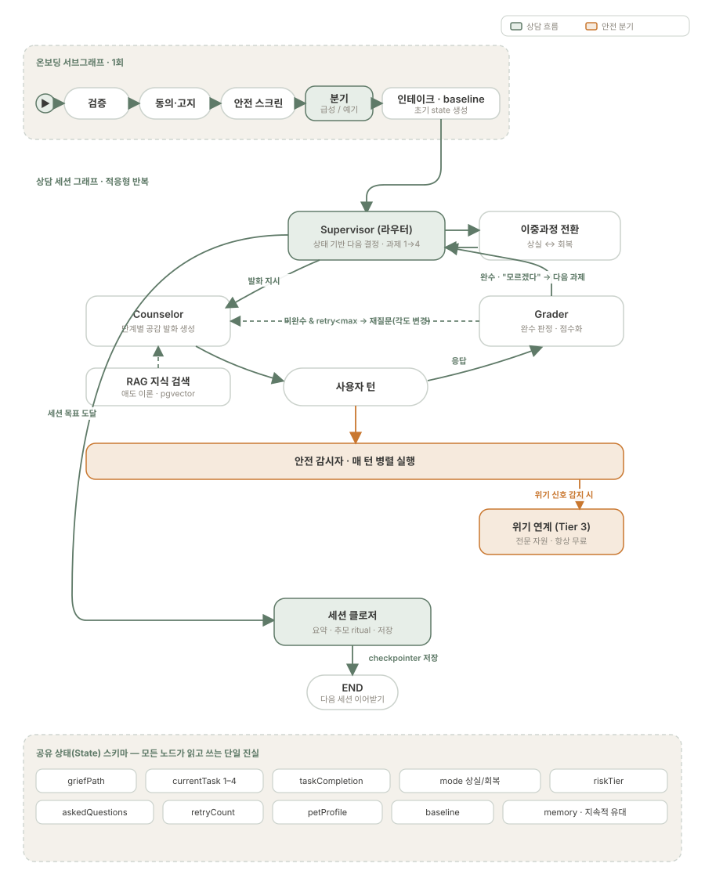

# 백엔드 ARCHITECTURE — Beside Pet

> NestJS + LangGraph.js 상담 에이전트의 내부 설계. "왜 이렇게 했나"를 설명하기 위한 문서.
> 제품 맥락은 [../01-product-overview.md](../01-product-overview.md), 전체 그림은 [../02-architecture.md](../02-architecture.md).

---

## 1. 설계 원칙 (한 줄)

> **흐름은 그래프(상태머신)가, 발화는 에이전트가.** 단계는 *상태*에, 에이전트는 *역할*에.

상담형 대화는 흐름을 LLM의 자율 판단에 맡기면 맴돌기 쉽다. 그래서 흐름을 코드(상태 그래프)로 끌어내려 통제한다.

## 2. 에이전트 구성 (역할 4 + 도구 2)

> 원칙: **상담 단계마다 에이전트를 만들지 않는다.** 단계 전이는 그래프가 맡는다.

| 역할 | 책임 | 파일 |
|------|------|------|
| Supervisor | 상태 기반 다음 결정, 과제 전이, 이중과정 모드 전환 | `src/graph/nodes/supervisor.node.ts` |
| Counselor | 현재 과제·모드에 맞는 공감 발화 (단일 에이전트, 파라미터화) | `src/graph/nodes/counselor.node.ts` |
| Grader | 완수 판정·점수화, **"모르겠다"를 정상 완수로 처리** | `src/graph/nodes/grader.node.ts` |
| Safety | 위기 감지 시 상담 중단·전문 연계(Tier 3) | `src/graph/nodes/safety.node.ts` |
| RAG (도구) | 애도 지식 검색 (pgvector) | `src/rag/retriever.ts` |
| Summarizer (도구) | 세션 요약 → 세션 간 기억 | `src/llm/claude.client.ts` |

> Counselor가 단계마다 분화하지 않는 이유: 단계 정보는 `state.currentTask`/`state.mode`로 주입되고, 같은 에이전트가 파라미터에 따라 다르게 발화한다. 단계를 에이전트로 만들면 역할이 겹치고 에이전트가 비대해진다 — 단계는 상태에, 에이전트는 역할에 둔다.

## 3. 무한루프 방지 (이 프로젝트의 핵심)



`src/graph/counseling.graph.ts`의 `routeAfterGrade` 조건부 전이:

```
satisfied (또는 "모르겠다")       → supervisor (다음 과제)
!satisfied && retry < MAX_RETRY   → counselor (각도 바꿔 재질문, 같은 질문 ❌)
retry >= MAX_RETRY                → supervisor (폴백 전이 — 반드시 탈출)
riskDetected                      → safety → END
```

세 가지 장치가 맞물려 루프를 *구조적으로* 제거한다:

1. **`grader.node.ts`가 "모르겠다"를 `satisfied=true`로 처리** → "모르겠다"를 미완료로 보고 같은 질문을 되묻는 맴돌이를 차단.
2. **`askedQuestions` 기록** → Counselor는 이미 한 질문을 다시 하지 않는다.
3. **`retryCount >= MAX_RETRY(2)` 폴백 전이** → 어떤 경로로 들어와도 반드시 빠져나간다.

> 생성 모델이 자유롭게 되묻지 못하도록 **라우터가 흐름을 통제**한다 — 흐름 제어는 프롬프트가 아니라 코드의 책임이다.

## 4. 단일 상태 (`src/state/graph-state.ts`)

모든 노드가 하나의 `GraphState`를 읽고 쓴다. checkpointer(Postgres)에 직렬화되어 세션 간 이어받기를 가능하게 한다.

| 필드 | 역할 |
|------|------|
| `currentTask` / `taskCompletion` | Worden 4과제 진행 · 진행률 = 완료(≥`COMPLETION_THRESHOLD` 0.6) / 4 |
| `askedQuestions` | 재질문 금지용 질문 이력 |
| `retryCount` / `MAX_RETRY` | 폴백 전이 트리거 |
| `mode` | 이중과정모델 (`loss` ↔ `restoration`) |
| `riskTier` | 안전 등급 (1~3) |
| `memory` | 세션 간 기억 (지속적 유대) |
| `lastGrade` | 라우팅 보조 (Grader 결과) |

핵심 상수: `MAX_RETRY = 2`, `COMPLETION_THRESHOLD = 0.6`. `overallProgress(state)`가 진행률(0~1)을 단순 계산으로 돌려준다.

## 5. 세션 설계

- **한 세션 = 과제 1개**(많아야 2개). 한 번에 다 처리하지 않는다.
- 세션 구조: 오프닝(재안정·요약 회상) → 본론(상실↔회복 오가기) → 클로징(요약·추모 ritual·예고).
- **세션 수는 고정하지 않는다.** 기본 아크 ≈ 6세션(온보딩 + 과제 4 + 마무리)이되 Grader가 진도를 조절.

## 6. 온보딩 (`src/graph/nodes/onboarding.node.ts`)

검증 → 동의·고지 → 안전 스크린 → **분기(급성/예기)** → 인테이크·baseline. 산출물 = 초기 state.

- 원칙: 문진표 ❌ · 검증 먼저 · 모든 질문 건너뛰기 허용.
- 핵심 분기: **이미 떠남(acute)** vs **아직 곁에 있음 = 노령·말기(anticipatory)**. 두 경로는 로드맵이 다르다.

## 7. 데이터 / 저장

- 채팅 본문 = Postgres **JSONB**(raw 보존), 미디어 = **S3**(DB엔 참조만), 임베딩 = **pgvector**. → Postgres 한 시스템으로 관계형+문서+벡터 커버.
- `raw → 가공(ETL) → 인사이트` 레이어 분리. 인사이트는 **동의·비식별·집계** 전제.

## 8. REST 표면 (`src/session/session.controller.ts`)

프론트가 호출하는 유일한 창구. 상담 로직은 전부 이 뒤에 있다.

| 메서드 | 경로 | 용도 |
|--------|------|------|
| POST | `/sessions` | 새 세션 시작 (`{ sessionId, griefPath, seed? }`) |
| POST | `/sessions/:id/messages` | 사용자 턴 전송 (`{ text }`) |

API 키(Claude)는 서버에만 존재한다.

## 9. 모델 운용

- **Sonnet** = Counselor (공감 품질), **Haiku** = Grader/Summarizer (저렴·고빈도).
- 모델 선택은 *흐름 구조가 정해진 뒤*의 비용/품질 최적화 문제로만 다룬다. 흐름 제어를 상태 그래프가 책임지므로 발화 모델은 역할별로 교체할 수 있다.

## 10. 관측 / 평가

- **Langfuse** 트레이싱 — 노드별 입력·근거·출력 가시화.
- **RAGAS** — RAG 근거 충실도 평가 → 개선 루프를 닫는다.

## 11. 향후 (Next)

실제 Claude 호출(`src/llm/claude.client.ts`) → checkpointer 연결 → pgvector 검색·RAGAS 평가 → 예기 경로 → 과제 2~4 → 프론트 실연결.

---

### 설계 한 줄

> "흐름은 상태 그래프로 통제하고 AI는 노드 안에서 발화만 한다. '모르겠다'를 정상 완수로 처리하고 폴백 전이를 두어, 상담이 같은 질문을 맴도는 일을 구조적으로 차단했다."
